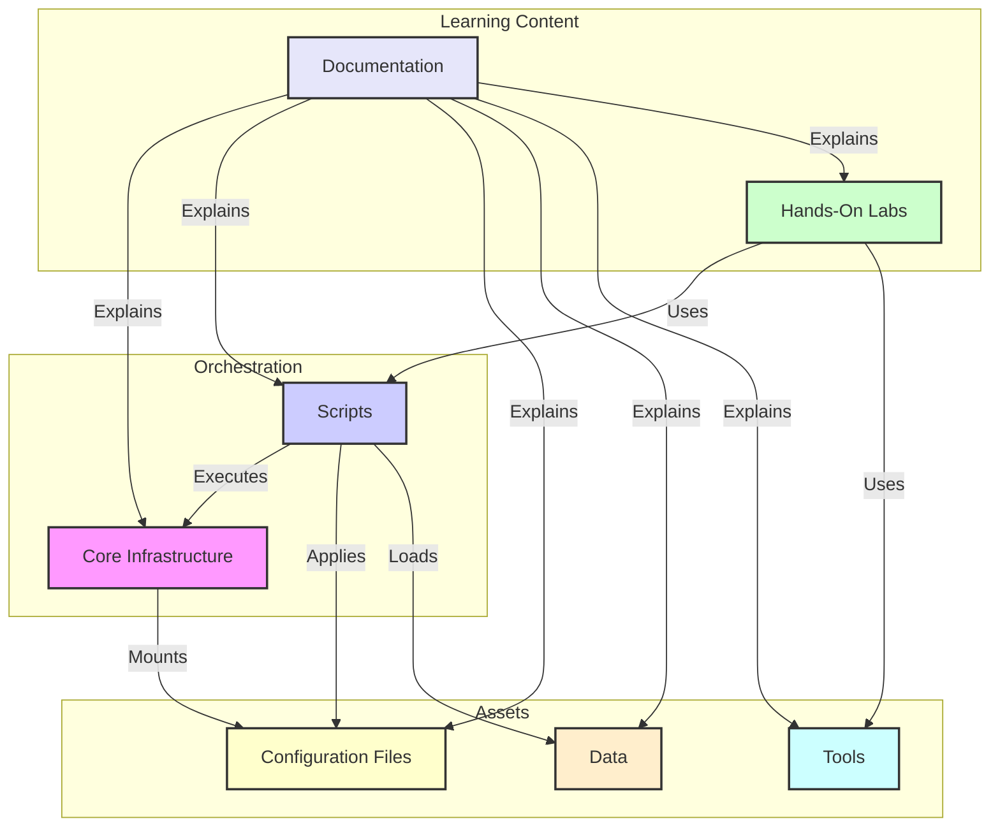
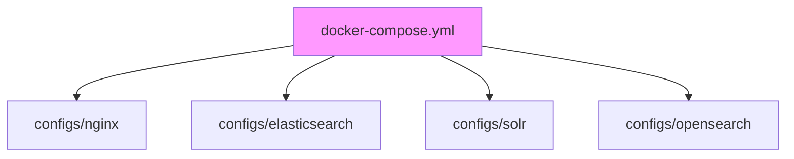
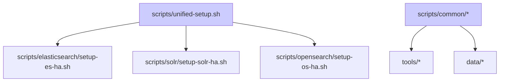
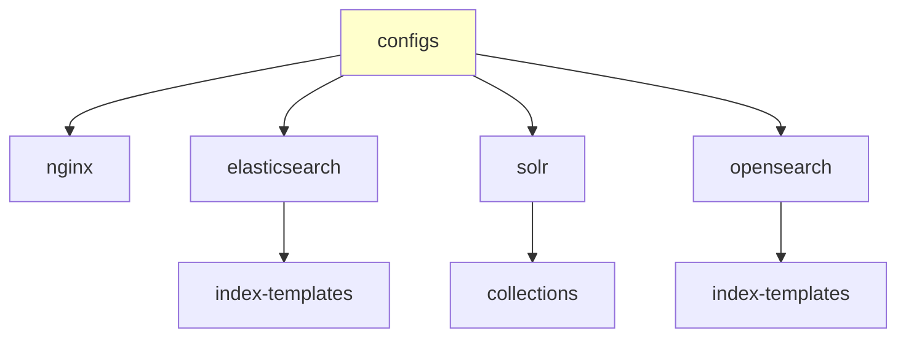
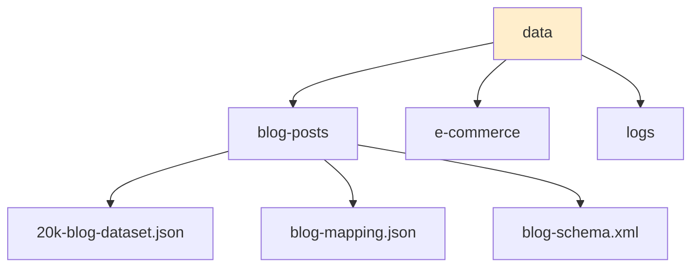
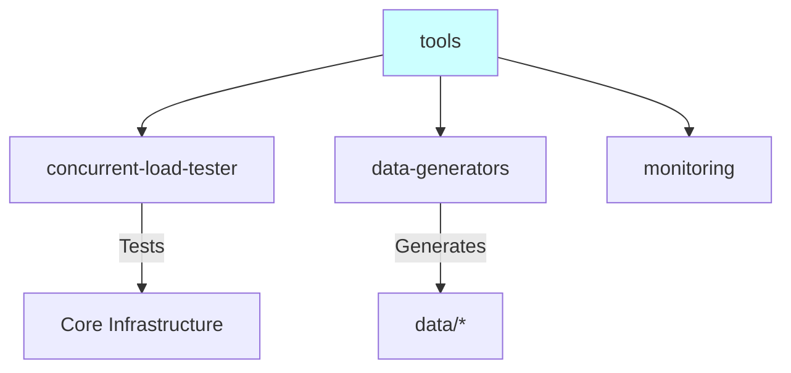
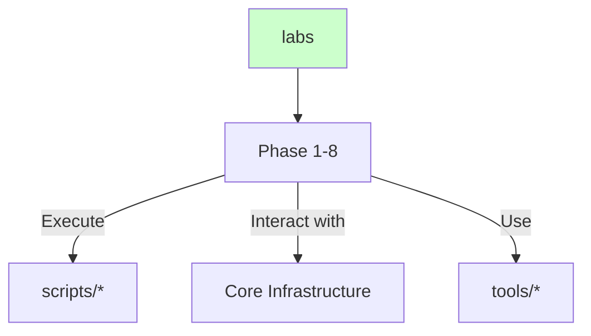
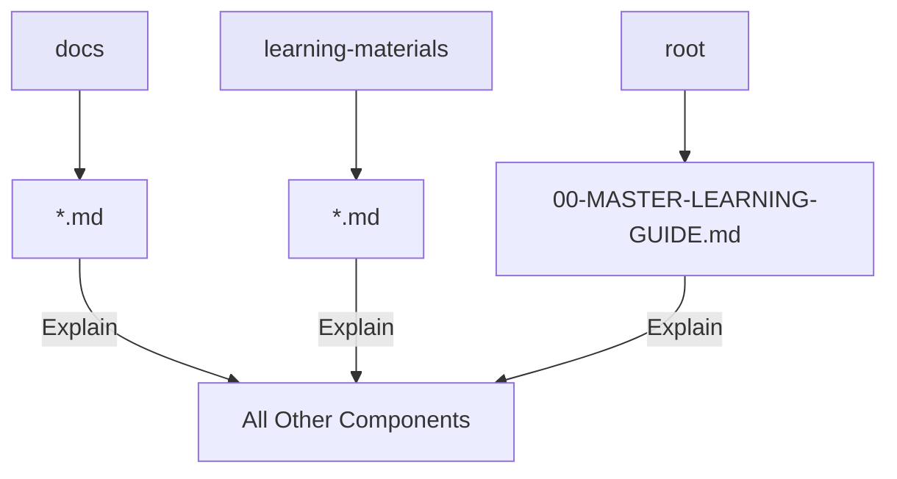

# 🗺️ Project Architecture & Dependency Graph

This document provides a visual representation of the project's architecture. The main diagram below shows the high-level components. **Click on a component to jump to its detailed diagram.**

## Master Architecture Diagram

---

## Detailed Diagrams

### Core Infrastructure Detail

### Scripts Detail

### Configuration Files Detail

### Data Detail

### Tools Detail

### Labs Detail

### Documentation Detail

